# Dokka Plugins

A collection of misc. plugins for dokka that add a few useful things.

## Dokka Script Plugin

[](https://search.maven.org/search?q=g:ca.solo-studios%20a:dokka-script-plugin)

Include custom `.js` scripts, similar to how it is done with css styles and images.

### Including

To use this plugin, add the following to your buildscript:

```kotlin
dependencies {
    dokkaPlugin("ca.solo-studios:dokka-script-plugin:[VERSION]")
}
```

### Usage

The plugin is used as follows:

```kotlin
tasks {
    withType<AbstractDokkaTask>().configureEach {
        // type-safe plugin configuration
        pluginConfiguration<DokkaScriptsPlugin, DokkaScriptsConfiguration> {
            scripts = listOf(file("somescript.js")) // List<File>
            remoteScripts = listOf("https://example.com/somescript.js") // List<String>
        }
        // json plugin configuration
        val dokkaTweaksConfiguration = """
        {
            "scripts": ["somescript.js"],
            "remoteScripts": ["https://example.com/somescript.js"]
        }
        """
        pluginConfiguration.set(
            mapOf(
                "ca.solostudios.dokkastyles.plugin.DokkaStyleTweaksPlugin" to dokkaTweaksConfiguration,
            )
        )
    }
}
```

The scripts are included on every single page.

## Dokka Style Tweaks Plugin

[](https://search.maven.org/search?q=g:ca.solo-studios%20a:dokka-style-tweaks-plugin)

Applies custom style tweaks to dokka to make it look better.
All tweaks are opt-in, so by default the plugin applies no changes.

### Including

To use this plugin, add the following to your buildscript:

```kotlin
dependencies {
    dokkaPlugin("ca.solo-studios:dokka-style-tweaks-plugin:[VERSION]")
}
```

### Features

- Minimal scrollbar
- Dark mode purple highlight
- Fix color-scheme in dark theme
- Improved block quotes
    - Improved block quote border
    - Distinguished block quote text
- Improved section tab (eg. the "Members" tab)
    - Improved section tab border
    - Set section tab font weight
    - Add transition for section tab
- Disable code wrapping
- Custom sidebar width

### Minimal Scrollbar

<details>
<summary>Expand</summary>

#### Summary

Makes the scrollbar style more minimalist,
as well as making the scrollbar look better in dark mode.

#### Usage

```kotlin
tasks {
    withType<AbstractDokkaTask>().configureEach {
        // type-safe plugin configuration
        pluginConfiguration<DokkaStyleTweaksPlugin, DokkaStyleTweaksConfiguration> {
            minimalScrollbar = true
        }
        // json plugin configuration
        val dokkaTweaksConfiguration = """
        {
            "minimalScrollbar": true
        }
        """
        pluginConfiguration.set(
            mapOf(
                "ca.solostudios.dokkastyles.plugin.DokkaStyleTweaksPlugin" to dokkaTweaksConfiguration,
            )
        )
    }
}
```

#### Screenshots

Off:

| Browser | Light Mode                                       | Dark Mode                                       |
|---------|--------------------------------------------------|-------------------------------------------------|
| Chrome  |   |   |
| Firefox |  |  |

On:

| Browser | Light Mode                                      | Dark Mode                                      |
|---------|-------------------------------------------------|------------------------------------------------|
| Chrome  | 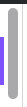  | 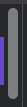  |
| Firefox | 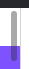 |  |

</details>

### Dark Mode Purple Highlight

<details>
<summary>Expand</summary>

#### Summary

Highlights the selected sidebar item in purple when in dark mode,
for parity with light mode.

#### Usage

```kotlin
tasks {
    withType<AbstractDokkaTask>().configureEach {
        // type-safe plugin configuration
        pluginConfiguration<DokkaStyleTweaksPlugin, DokkaStyleTweaksConfiguration> {
            darkPurpleHighlight = true
        }
        // json plugin configuration
        val dokkaTweaksConfiguration = """
        {
            "darkPurpleHighlight": true
        }
        """
        pluginConfiguration.set(
            mapOf(
                "ca.solostudios.dokkastyles.plugin.DokkaStyleTweaksPlugin" to dokkaTweaksConfiguration,
            )
        )
    }
}
```

#### Screenshots

Off:

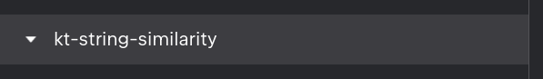

On:

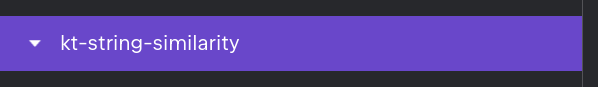

</details>

### Fix color-scheme In Dark Mode

<details>
<summary>Expand</summary>

#### Summary

Sets `color-scheme` to `dark` when the dark mode is enabled.

#### Usage

```kotlin
tasks {
    withType<AbstractDokkaTask>().configureEach {
        // type-safe plugin configuration
        pluginConfiguration<DokkaStyleTweaksPlugin, DokkaStyleTweaksConfiguration> {
            darkColorSchemeFix = true
        }
        // json plugin configuration
        val dokkaTweaksConfiguration = """
        {
            "darkColorSchemeFix": true
        }
        """
        pluginConfiguration.set(
            mapOf(
                "ca.solostudios.dokkastyles.plugin.DokkaStyleTweaksPlugin" to dokkaTweaksConfiguration,
            )
        )
    }
}
```

</details>

### Improved Block Quote Border

<details>
<summary>Expand</summary>

#### Summary

Improves the border of block quotes.

#### Usage

```kotlin
tasks {
    withType<AbstractDokkaTask>().configureEach {
        // type-safe plugin configuration
        pluginConfiguration<DokkaStyleTweaksPlugin, DokkaStyleTweaksConfiguration> {
            improvedBlockquoteBorder = true
        }
        // json plugin configuration
        val dokkaTweaksConfiguration = """
        {
            "improvedBlockquoteBorder": true
        }
        """
        pluginConfiguration.set(
            mapOf(
                "ca.solostudios.dokkastyles.plugin.DokkaStyleTweaksPlugin" to dokkaTweaksConfiguration,
            )
        )
    }
}
```

#### Screenshots

Off:


On:

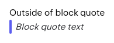
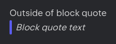

</details>

### Distinguished Block Quote Text

<details>
<summary>Expand</summary>

#### Summary

Makes the block quote text visually different from the rest of the text.

#### Usage

```kotlin
tasks {
    withType<AbstractDokkaTask>().configureEach {
        // type-safe plugin configuration
        pluginConfiguration<DokkaStyleTweaksPlugin, DokkaStyleTweaksConfiguration> {
            lighterBlockquoteText = true
        }
        // json plugin configuration
        val dokkaTweaksConfiguration = """
        {
            "lighterBlockquoteText": true
        }
        """
        pluginConfiguration.set(
            mapOf(
                "ca.solostudios.dokkastyles.plugin.DokkaStyleTweaksPlugin" to dokkaTweaksConfiguration,
            )
        )
    }
}
```

#### Screenshots

Off:

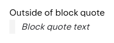
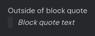

On:

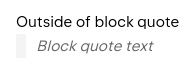
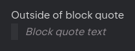

</details>

### Improved Section Tab Border

<details>
<summary>Expand</summary>

#### Summary

Improves the border of section tabs.

#### Usage

```kotlin
tasks {
    withType<AbstractDokkaTask>().configureEach {
        // type-safe plugin configuration
        pluginConfiguration<DokkaStyleTweaksPlugin, DokkaStyleTweaksConfiguration> {
            improvedSectionTabBorder = true
        }
        // json plugin configuration
        val dokkaTweaksConfiguration = """
        {
            "improvedSectionTabBorder": true
        }
        """
        pluginConfiguration.set(
            mapOf(
                "ca.solostudios.dokkastyles.plugin.DokkaStyleTweaksPlugin" to dokkaTweaksConfiguration,
            )
        )
    }
}
```

#### Screenshots

Off:


On:


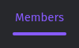

</details>

### Section Tab Font Weight

<details>
<summary>Expand</summary>

#### Summary

Changes the font weight of the section tab.

#### Usage

```kotlin
tasks {
    withType<AbstractDokkaTask>().configureEach {
        // type-safe plugin configuration
        pluginConfiguration<DokkaStyleTweaksPlugin, DokkaStyleTweaksConfiguration> {
            sectionTabFontWeight = "500"
        }
        // json plugin configuration
        val dokkaTweaksConfiguration = """
        {
            "sectionTabFontWeight": "500"
        }
        """
        pluginConfiguration.set(
            mapOf(
                "ca.solostudios.dokkastyles.plugin.DokkaStyleTweaksPlugin" to dokkaTweaksConfiguration,
            )
        )
    }
}
```

#### Screenshots

Note: it will look different depending on the font weight you select.

Off:


On:


</details>

### Section Tab Transition

<details>
<summary>Expand</summary>

#### Summary

Transition for when hovering over/selecting section tabs.

#### Usage

```kotlin
tasks {
    withType<AbstractDokkaTask>().configureEach {
        // type-safe plugin configuration
        pluginConfiguration<DokkaStyleTweaksPlugin, DokkaStyleTweaksConfiguration> {
            sectionTabTransition = true
        }
        // json plugin configuration
        val dokkaTweaksConfiguration = """
        {
            "sectionTabTransition": true
        }
        """
        pluginConfiguration.set(
            mapOf(
                "ca.solostudios.dokkastyles.plugin.DokkaStyleTweaksPlugin" to dokkaTweaksConfiguration,
            )
        )
    }
}
```

</details>

### Disable Code Wrapping

<details>
<summary>Expand</summary>

#### Summary

Disables wrapping of code blocks if the line is too long.

#### Usage

```kotlin
tasks {
    withType<AbstractDokkaTask>().configureEach {
        // type-safe plugin configuration
        pluginConfiguration<DokkaStyleTweaksPlugin, DokkaStyleTweaksConfiguration> {
            disableCodeWrapping = true
        }
        // json plugin configuration
        val dokkaTweaksConfiguration = """
        {
            "disableCodeWrapping": true
        }
        """
        pluginConfiguration.set(
            mapOf(
                "ca.solostudios.dokkastyles.plugin.DokkaStyleTweaksPlugin" to dokkaTweaksConfiguration,
            )
        )
    }
}
```

#### Screenshots

Note: A scrollbar is shown on hover.

Off:

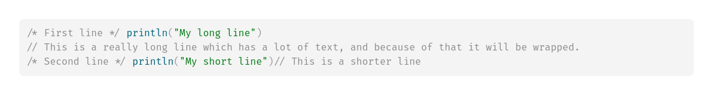
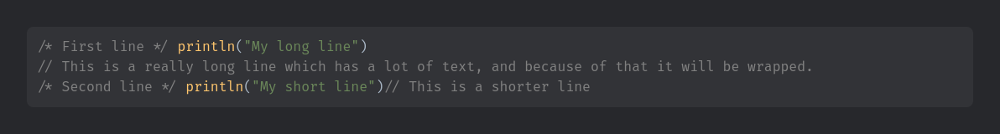

On:

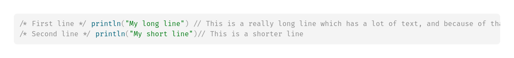
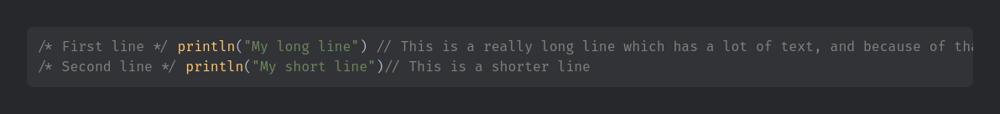

</details>

### Sidebar Width

<details>
<summary>Expand</summary>

#### Summary

Sets a custom width for the sidebar.

#### Usage

```kotlin
tasks {
    withType<AbstractDokkaTask>().configureEach {
        // type-safe plugin configuration
        pluginConfiguration<DokkaStyleTweaksPlugin, DokkaStyleTweaksConfiguration> {
            sidebarWidth = "500px"
        }
        // json plugin configuration
        val dokkaTweaksConfiguration = """
        {
            "sidebarWidth": "500px"
        }
        """
        pluginConfiguration.set(
            mapOf(
                "ca.solostudios.dokkastyles.plugin.DokkaStyleTweaksPlugin" to dokkaTweaksConfiguration,
            )
        )
    }
}
```

</details>
